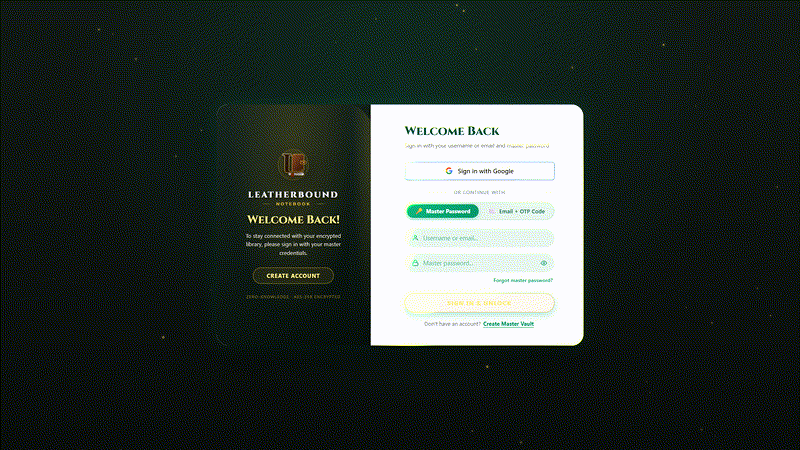
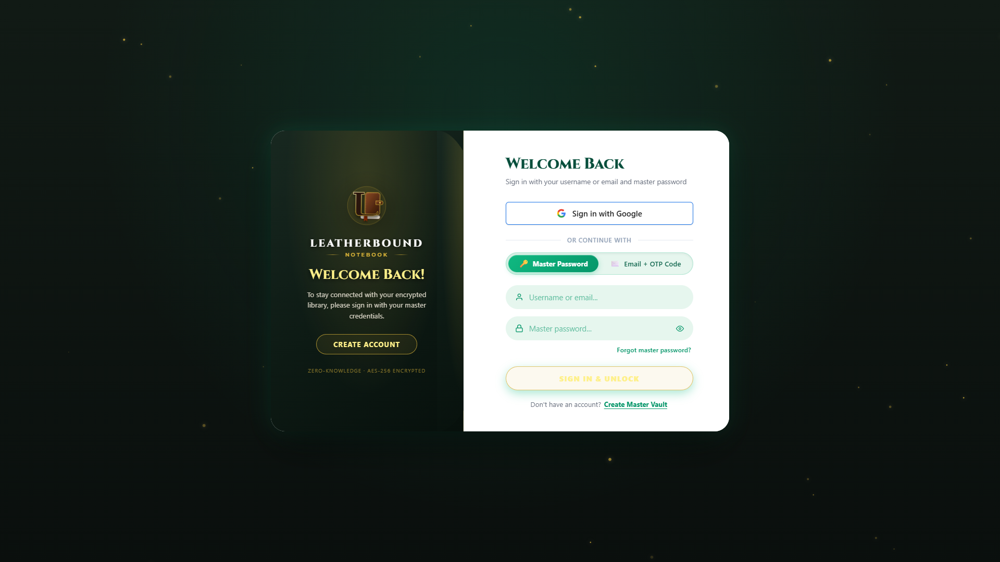
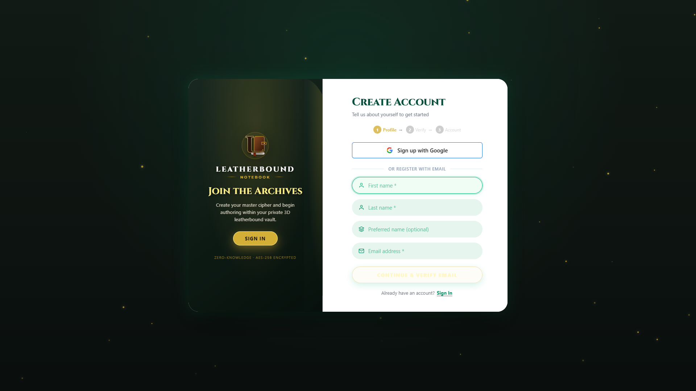
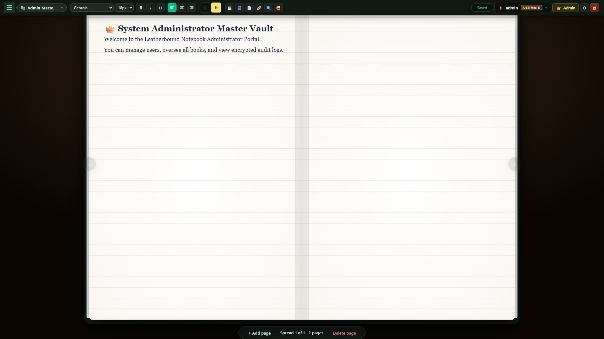

<div align="center">

# 📖 Leatherbound Notebook 2.0

### *A Private, Local-First, Encrypted 3D Skeuomorphic Notebook & Interactive Workspace*

[](https://www.typescriptlang.org/)
[](https://reactjs.org/)
[](https://threejs.org/)
[](https://vitejs.dev/)
[](https://expressjs.com/)
[](https://www.sqlite.org/)
[](https://developers.google.com/identity/protocols/oauth2)
[](https://github.com/gochalamvinod/LeatherBound-Notebook)
[](#-license--intellectual-property)

<p align="center">
  <b>Experience the tactile warmth of a classic leatherbound journal combined with modern digital productivity.</b><br>
  Self-hosted, zero-cloud data leakage, military-grade client encryption, hardware-accelerated 3D interactions, zero-popup Google Sign-In, and authentic SMTP delivery.
</p>

</div>

---

## 🎬 30-Second Interactive Feature Preview

<div align="center">
  <p><b>Experience the full 30-second opening and feature tour:</b></p>
  
  <br><br>
  <p>
    <b>📹 Full 30-Second High-Definition Video Tour:</b><br>
    <a href="assets/previews/leatherbound_preview_30s.mp4">▶ <b>Download / Watch 1080p MP4 Video</b></a> &bull;
    <a href="assets/previews/leatherbound_preview_30s.webm">▶ <b>Play High-Efficiency WebM Video</b></a>
  </p>
</div>

---

## 📸 Visual Gallery & Feature Showcase

<div align="center">
  <table>
    <tr>
      <td width="50%" align="center">
        <b>🔐 Zero-Popup Google OAuth & Dual-Identifier Sign-In</b><br><br>
        
      </td>
      <td width="50%" align="center">
        <b>✨ 3-Step Sovereign Registration Wizard & In-Line OTP</b><br><br>
        
      </td>
    </tr>
    <tr>
      <td width="50%" align="center">
        <b>🖋️ 3D Golden Fountain Pen Morphing & Opening</b><br><br>
        
      </td>
      <td width="50%" align="center">
        <b>📖 3D Leatherbound Vault Spread & Typography Suite</b><br><br>
        
      </td>
    </tr>
    <tr>
      <td width="50%" align="center">
        <b>🔄 Interactive 3D Page Turn & Realistic Curled Paper Physics</b><br><br>
        
      </td>
      <td width="50%" align="center">
        <b>👤 User Profile, Account Settings & Live Storage Meter</b><br><br>
        
      </td>
    </tr>
  </table>
</div>

---

## 🌟 Highlights & Key Features

### 🔐 Multi-Step Sovereign Registration Wizard
- **Step 1 — Profile & Email**: Captures `First Name` *(required)*, `Last Name` *(required)*, `Preferred Name` *(optional)*, and `Email Address` *(required)*. Automatically verifies email format and initiates single-use OTP dispatch.
- **Step 2 — In-Line 6-Digit OTP Verification**: Interactive digit cells with auto-advance, paste sanitization, live expiration countdown, spam folder guidance, and escalating resend cooldowns (`60s` → `120s` → `180s` → lockout).
- **Step 3 — Post-Verification Account Customization**:
  - **Username Field**: Starts completely blank (no email auto-fill), with live debounced availability verification (`✓ Available` / `⚠️ Taken` / `Username can't be empty`), and blocks submission until a valid username is provided.
  - **Master Password**: Real-time password strength meter and visibility toggle.
  - **Vault Initialization**: Custom Notebook Title and 5 antique leather cover theme swatches.

### 🌐 Direct Zero-Popup Google OAuth 2.0 Flow
- **Single-Tab Direct Navigation**: Clicking **"Sign in with Google"** directly navigates to Google's official OAuth consent screen (`/api/auth/google` → `accounts.google.com`) in the same window, completely eliminating blank popup windows (`about:blank`).
- **Server-Side Token Exchange & DEK Derivation**: Upon user consent, Google redirects back to `/api/auth/callback/google`. The server exchanges authorization codes for ID tokens, derives a private zero-knowledge encryption key, wraps administrative envelopes, and seamlessly unlocks the user's encrypted local vault.
- **Client Auto-Discovery**: Automatically discovers and loads OAuth credentials from `.env` or local Google client secret files (`client_secret_*.json`).

### 🔑 Dual-Identifier Universal Sign-In
- **Username OR Email**: Sign in using either your unique **Username** or your registered **Email Address** in a unified identity field.
- **Password Mode**: Automatically resolves user identity, retrieves cryptographic salt, unwraps admin/KWK envelopes, and decrypts the encrypted notebook vault.
- **Email OTP Mode**: Resolves username or email to the registered address, dispatches a single-use 6-digit code, and directly opens the vault upon verification.

### 🛑 Strict One Account Per Email Policy
- **Duplicate Prevention**: Rejects duplicate email registrations at Step 1 (`/api/auth/send-otp`) and Step 3 (`/api/auth/verify-otp`) with a clear error: `An account with email "..." already exists. Please log in instead.`
- **Database Unique Constraint**: Enforced at the SQLite storage layer with a case-insensitive `UNIQUE INDEX` on `users(email COLLATE NOCASE)`.

### 📬 Resilient Transactional Email Engine & Dual-Port Fallback
- **Titan Mail & Custom SMTP Support**: Production-grade authenticated mail transport configured for port `587` with STARTTLS (`secure: false`) and non-pooling architecture to eliminate Windows network socket timeouts.
- **Automatic Port Fallback**: If port `587` encounters a network timeout or firewall block, the mailer automatically and instantly attempts port `465` (or vice-versa), ensuring OTP codes are delivered without failure.
- **Clean Anti-Spam Headers**: Dual-MIME parity (luxury HTML + clean plain-text fallback), domain-authenticated Message-ID, `Auto-Submitted: auto-generated`, and `X-Mailer` identification.

### ✉️ Automated Security & Welcome Notifications
- **Congratulations / Welcome Signup Email**: Automatically dispatched upon new account creation (via Email OTP, Master Password, or Google OAuth onboarding) featuring an executive dark emerald & gold foil skeuomorphic design.
- **Login Attempt Security Notification Email**: Automatically dispatched on every successful login, featuring rich connection telemetry:
  - **Timestamp**: Localized date and UTC time.
  - **Client IP Address**: Formatted IPv4 or IPv6 address.
  - **Resolved Geolocation**: City, Region, and Country resolved via IP lookup with graceful local subnet fallback.
  - **Device & Operating System**: Detected OS (e.g. Windows, macOS, Linux, iOS, Android) and device category.
  - **Browser**: Name and version (e.g. Chrome, Firefox, Safari, Edge).
  - **Authentication Method**: Identifies `Google Sign-In`, `Email OTP`, or `Master Password`.
  - **Security Advisory**: Immediate instructions if the session was unexpected.

### 👤 User Profile & Account Settings Modal
- **Quick Access**: Available directly from the top-right Header Toolbar user badge and the Mobile Navigation Drawer.
- **Real-Time Availability Validation**: Live debounced verification for both Username (`/api/users/check-username`) and Email (`/api/users/check-email`).
- **Safe Vault Renaming**: Seamlessly renames disk vault files (`.enc.json`), updates SQLite records, and preserves library index entries without dropping the active session.
- **Identity & Storage Meter**: Displays customized avatars with tier rings, creation dates, authentication provider badges, and live vault storage quota progress bars.

### 🛡️ Master Admin Audit Logging
- **Comprehensive Audit Trail**: Automatically records every authentication attempt (`USER_LOGIN`, `USER_REGISTER`), OTP verification, password change, and book action.
- **Telemetry Tracking**: Records actor, client IP, OS, browser, device type, target resource, and ISO timestamps in the SQLite `audit_logs` table for administrative review.

### 🖋️ 3D Golden Fountain Pen Morphing Lifecycle
- **60 FPS Three.js Procedural Pen**: Features a 24K gold nib, fluted grip, midnight lacquer barrel, and radiant nib tip glow.
- **Symmetrical Wing Expansion**: When unlocking or creating a notebook, the golden pen aligns with the center axis and expands smoothly into the open leatherbound book spread.
- **Direct 1ms Lock Transition**: On closing, the notebook folds symmetrically inwards into the golden pen, presents an elegant *"Thank You for Writing"* plaque, and transitions directly to the Lock Screen.

### 👤 Identity & Compulsory Username Book Title System
- **Compulsory Prefix Enforcement**: Every notebook created, setup, renamed, or saved strictly and compulsorily starts with `{username}_` (e.g. `vinod_notebook` or `vinod_trading_journal`).
- **Smart Auto-Redirect On Sign-In**: Attempting to sign in with an unregistered username or email instantly transitions to the **Create Account** tab with credentials pre-filled.

### 📚 Tactile Skeuomorphic Aesthetic & Custom Covers
- **5 Premium Leather Finishes**: Emerald Pine, Classic Brown, Midnight Navy, Royal Burgundy, and Obsidian Noir.
- **Authentic Journal Ambiance**: Subtle parchment ruled lines, physical paper depth, embossed brass clasps, and realistic page curling.
- **Dynamic Aspect Ratio Engine**: Choose from 1:1 Square, 1:1.2 Classic Journal, 1:1.4 Golden Ratio, 1:1.6 Widescreen, or Custom proportions with optimal screen space utilization.

### 📝 Comprehensive Rich-Text & Media Suite
- **Full Typography Controls**: Font family selection (Georgia, Garamond, Merriweather, Playfair Display, Cinzel, JetBrains Mono), sizes, colors, highlights, text alignment, and emoji picker.
- **Unified 8-Handle Circular Resizer**: Effortlessly drag, scale, and reposition images, videos, audio players, tables, code blocks, and live web embeds.
- **⚡ Instant Random-Access Video Streaming Engine**: `#EXT-X-INDEPENDENT-SEGMENTS` standalone keyframe decoding and smart window-based chunk eviction allows instant (<100ms) jumping to any hour without loading intermediate chunks.
- **Document & Spreadsheet Embeds**:
  - **Spreadsheets (`.xlsx`, `.xls`, `.csv`, `.tsv`, `.ods`)**: Powered by SheetJS with interactive spreadsheet previews, formula bars, and dynamic chart visualization.
  - **Documents (`.docx`, `.pptx`, `.pdf`)**: Native embedded parchment viewers with multi-page navigation and slide decks.
  - **Code Blocks**: Syntax-highlighted code viewer supporting over 20 programming languages.

### 🌐 Live Web Windows & Search
- **DuckDuckGo Live Search**: Search the web and embed live interactive browser frames or rich bookmark cards directly into your notes.
- **Interactive Web Embeds**: Built-in address bar, navigation buttons (Back, Forward, Refresh, Home, Open in Tab), and height resizers.

### 🔒 Zero-Knowledge Local Vault Security
- **AES-GCM-256 Encryption**: Your notebooks, pages, and media attachments are encrypted locally on your machine with Scrypt key derivation.
- **Single-Device Active Session Protection**: Automatically detects and handles superseded sessions.
- **Security Lockout Defense**: 30-minute lockout after 5 consecutive failed login attempts.
- **Multi-Tier Quota Management**: Built-in tier architecture supporting Free (Classic), VIP (Premium), and completely unlimited Sovereign (Ultimate) user quotas.

---

## 🏗️ Tech Stack Architecture

| Layer | Technology |
|---|---|
| **Frontend Framework** | React 18 (TypeScript, Strict Mode) |
| **3D Graphics & Animations** | Three.js (r165), WebGL, ACESFilmic Tone Mapping |
| **Document & Spreadsheet Engine** | SheetJS (`xlsx`), `fflate`, `html2canvas` |
| **Media Streaming** | HLS.js, Progressive MP4/WebM/Audio Streamers |
| **SMTP Mail Transport** | Nodemailer (Titan Mail / Google Workspace / Custom SMTP) |
| **Bundler & Dev Server** | Vite 7.3 with Rollup manual chunking |
| **Backend & Storage** | Node.js, Express 4.19, SQLite (`better-sqlite3`), Encrypted JSON Vault |

---

## ⚡ Quick Start & Installation

### Prerequisites
- [Node.js](https://nodejs.org/) (Version **18.0.0** or higher)
- `npm` (Version **9.0.0** or higher)

---

### 🛠️ Setup Instructions

#### 1. Clone the Repository
```bash
git clone https://github.com/gochalamvinod/LeatherBound-Notebook.git
cd LeatherBound-Notebook
```

#### 2. Install Dependencies
```bash
npm install
```

#### 3. Configure Support Email & Auth (`.env`)
You can configure your support email and SMTP credentials by double-clicking **`CONFIGURE_SUPPORT.bat`** (on Windows) or copying `.env.example`:
```bash
# On Windows, you can run:
CONFIGURE_SUPPORT.bat
```
Or manually create `.env`:
```env
PORT=3000

# SMTP Email Configuration (Port 587 STARTTLS with auto-fallback to 465)
SMTP_HOST=smtp.titan.email
SMTP_PORT=587
SMTP_SECURE=false
SMTP_USER=support@yourdomain.com
SMTP_PASS=your-password-here
SMTP_FROM="Leatherbound Vault" <support@yourdomain.com>
SMTP_REPLY_TO=support@yourdomain.com

# OTP Security & Expiration Settings (Optional)
OTP_EXPIRY_SECONDS=600
OTP_RESEND_COOLDOWN_SECONDS=60
OTP_MAX_ATTEMPTS=5

# Google OAuth 2.0 Configuration
GOOGLE_CLIENT_ID=your-client-id.apps.googleusercontent.com
GOOGLE_CLIENT_SECRET=your-google-client-secret
GOOGLE_REDIRECT_URI=http://localhost:3000/api/auth/callback/google
VITE_GOOGLE_CLIENT_ID=your-client-id.apps.googleusercontent.com
```

#### 4. Start Development Mode (Hot Reload)
```bash
npm run dev
```
Open your browser and navigate to:
```
http://localhost:3000
```

#### 5. Build and Run Production Server
```bash
# Typecheck and compile optimized client bundle
npm run build

# Start production server
npm start
```

---

## 📁 Project Structure

```
LeatherBound-Notebook/
├── CONFIGURE_SUPPORT.bat       # Interactive Windows SMTP support email setup utility
├── server.js                   # Express API, auth routing, vault encryption & SQLite sync
├── db/
│   ├── index.js                # SQLite DAO helpers & database initialization
│   └── schema.js               # SQLite DDL schema, tables & unique indexes
├── lib/
│   ├── mailer.js               # Nodemailer SMTP dispatcher, templates & anti-spam headers
│   └── otp.js                  # Salted HMAC-SHA256 OTP engine & escalating cooldowns
├── src/
│   ├── components/
│   │   ├── admin/              # Admin dashboard & user tier management
│   │   ├── auth/               # 3-Step RegisterTab, Dual-Identifier LoginTab, OtpVerificationPanel
│   │   ├── book/               # 3D BookRoom, PageSlot, and canvas renders
│   │   ├── document/           # SpreadsheetEditor & Chart viewers
│   │   ├── embeds/             # DuckDuckGo search & live web embed modals
│   │   ├── media/              # Resizable image/video overlays & toasts
│   │   ├── modals/             # Bookshelf, settings drawer, upgrade modal
│   │   ├── toolbar/            # Header skeuomorphic toolbar & controls
│   │   └── transitions/        # 3D Golden Fountain Pen morphing system
│   ├── context/                # AuthContext, VaultContext, EditorContext
│   ├── hooks/                  # Custom React hooks (useOtpTimer, usePageFlip, etc.)
│   ├── types/                  # TypeScript interfaces (otp.ts, api.ts, notebook.ts)
│   ├── App.tsx                 # Main application state machine & coordinator
│   └── App.css                 # Skeuomorphic styling, textures & animations
├── .env.example                # Template configuration file for SMTP & server settings
├── .gitignore                  # Git ignore rules for secrets, local databases, and builds
├── tsconfig.json               # TypeScript configuration
├── vite.config.ts              # Vite build & chunking configuration
└── package.json                # Dependencies and scripts
```

---

## ⌨️ Keyboard Shortcuts

| Shortcut | Action |
|---|---|
| <kbd>Ctrl</kbd> + <kbd>B</kbd> | Toggle **Bold** text formatting |
| <kbd>Ctrl</kbd> + <kbd>I</kbd> | Toggle *Italic* text formatting |
| <kbd>Ctrl</kbd> + <kbd>U</kbd> | Toggle <u>Underline</u> text formatting |
| <kbd>Ctrl</kbd> + <kbd>S</kbd> | Force save active notebook pages |
| <kbd>←</kbd> / <kbd>→</kbd> | Flip to Previous / Next page spread |
| <kbd>Esc</kbd> | Dismiss active media resizer or close modals |

---

## 👑 Tier Feature Matrix

| Feature | Classic (Free) | Premium (VIP) | Ultimate (Sovereign) |
|---|:---:|:---:|:---:|
| **Notebooks** | Up to 5 | Up to 100 | **Completely Unlimited (∞)** |
| **Pages per Notebook** | 20 Pages | 1,000 Pages | **Completely Unlimited (∞)** |
| **Total Vault Storage** | 5.0 GB | 100.0 GB | **Completely Unlimited (∞)** |
| **Media Upload Size** | 200 MB Video / 50 MB Docs | 2.0 GB Video / 500 MB Docs | **Completely Unlimited (∞)** |
| **Page Aspect Ratio Changes** | 5 per Book | 20 per Book | **Completely Unlimited (∞)** |
| **Leather Covers & Themes** | Standard 3 | Premium 6 | **All Covers & Custom Themes** |
| **AI God Mode & Voice** | ❌ | ✨ Standard | **⚡ Unlimited Access** |
| **Office & Excel Suite** | Full Access | Full Access | **⚡ Unlimited Access** |

---

## 📜 License & Intellectual Property
 
**PROPRIETARY & CONFIDENTIAL — ALL RIGHTS RESERVED**

This source code, visual designs, 3D animations, skeuomorphic assets, and architectures are proprietary and confidential to **Gochalam Vinod**. 

- **Private Repository**: This software is not open-source and is strictly **not free to use**.
- **No Unauthorized Use**: No part of this software, codebase, or associated design elements may be reproduced, distributed, copied, reverse-engineered, sublicensed, hosted, or publicly deployed in any form or by any means without explicit, prior written authorization from the copyright holder.

---

<div align="center">
  <sub>© 2026 Gochalam Vinod. All rights reserved.</sub>
</div>
